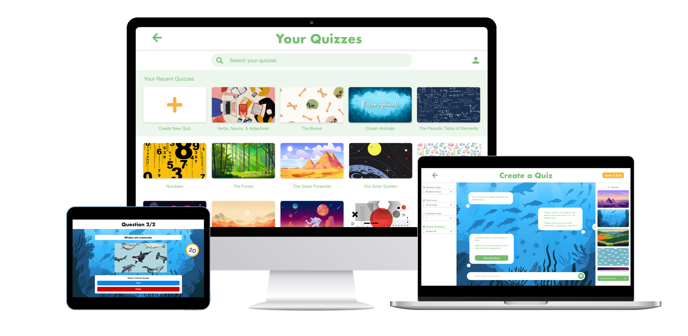

# Welcome to Quizli Documentation

<figure markdown="span">

</figure>

!!! note

    Quizli is current in _beta_ and this documentation is evolving fast with the app itself. Keep checking back here to see what new features and workflows are unlocked as Quizli approaches release.

**Transform your classroom with engaging e-learning activities**

Quizli is the essential learning management platform that delivers seamless
end-to-end testing solutions for educators.

## Teachers

- [Running a Quiz](teachers/running-a-quiz.md)
- [Creating a Quiz](teachers/creating-a-quiz.md)
- [Creating a Quiz with AI](teachers/creating-a-quiz-with-ai.md)

## Students

- [Taking a Quiz](students/take-quiz.md)

<figure markdown="span">
{style="max-height: 400px;"}
</figure>
