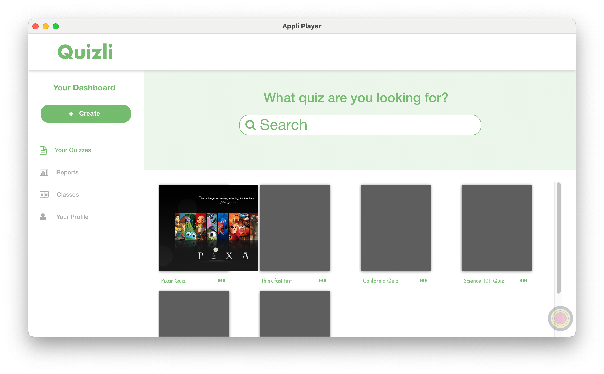
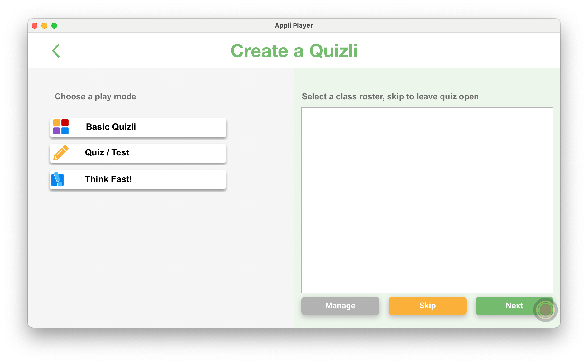
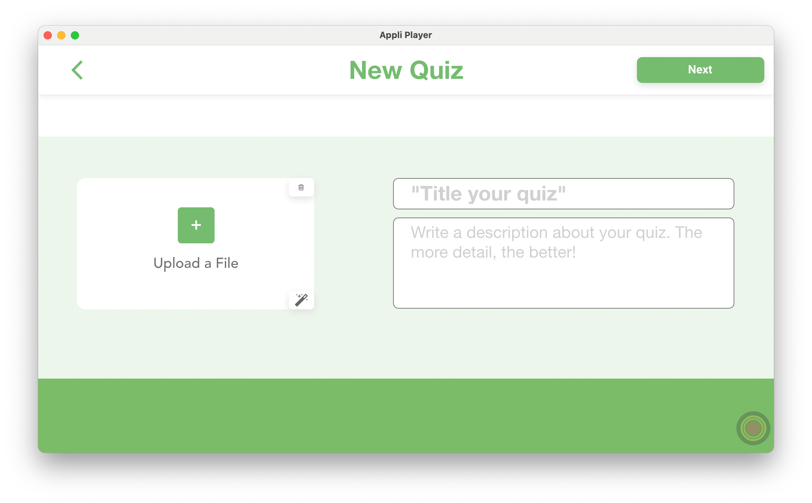
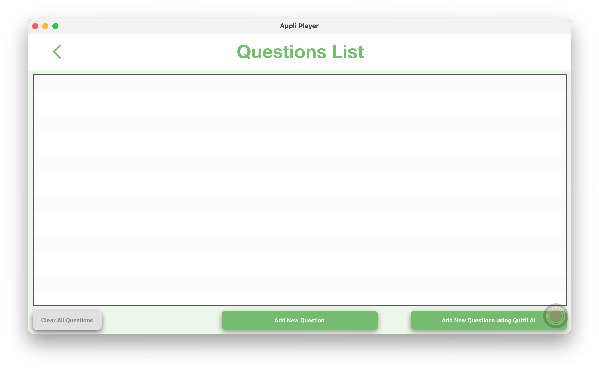
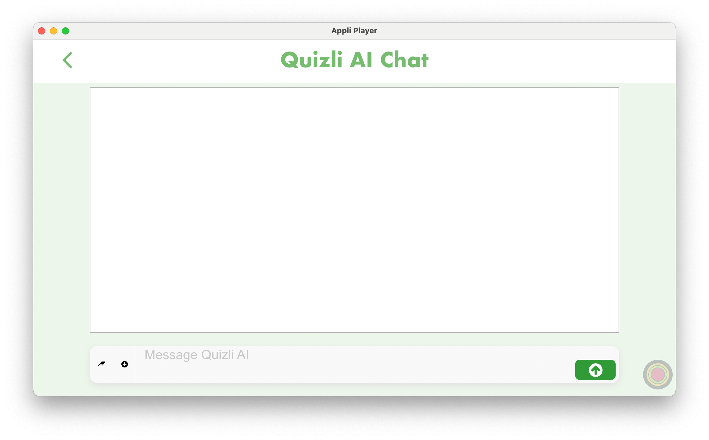
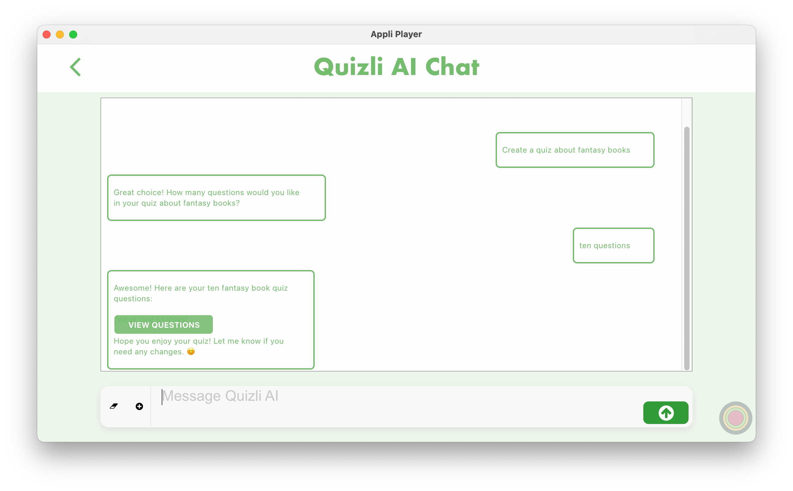
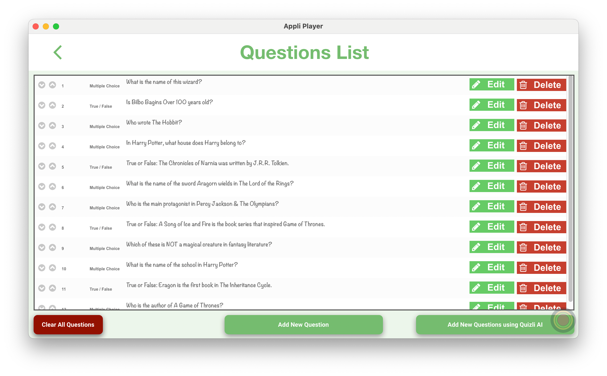

# Creating A Quiz with Quizli AI

<figure markdown="span">

</figure>

Click the `+ Create` button on the sidebar to create a new quiz.

<figure markdown="span">

<figcaption>Create A Quizli</figcaption>
</figure>

## Selecting the play mode

Quizli supports three play modes:

- **Basic Quizli:**
- **Quiz / Test:**
- **Think Fast:**

After selecting the play mode, you can either select a _class roster_ or leave it open so that it is available to all classes.

Click `Next` to move to the next step.

## New Quiz

<figure markdown="span">

<figcaption>Enter information about your new quiz</figcaption>
</figure>

In this screen, enter the information about your quiz. This information will be used to populate the main screen of Quizli teacher app. Don't forget to add a nice image to your quiz.

!!! Note

    **Create with AI:** Clicking the _small magic wand_ will use generative AI to create a thumbnail for you.

Click on the top right `Next` button to move forward to the questions list.

## Questions List

<figure markdown="span">

<figcaption>An empty questions list</figcaption>
</figure>

The list that occupies most of the screen will display your questions.

- **Clear All Questions:** will delete all your questions. Be careful with this one.
- **Add New Question:** allows you to manually enter the information to create a new question.
- **Add New Question using Quizli AI:** let's you leverage Quizli AI to create a question based on your input.

Let's dive deeper into the two ways of creating new questions.

## Add New Question using Quizli AI

<figure markdown="span">

<figcaption>Quizli AI Chat</figcaption>
</figure>

In this chat interface, you can request Quizli AI to create quizes for you. In the example below, I asked it to create a 10 questions fantasy books quiz for me.

<figure markdown="span">

<figcaption>Quizli AI Chat</figcaption>
</figure>

Once Quizli AI creates the questions for you, click the `View Questions` button to add them to the questions list. You can edit and customise the AI generated questions just like the manually entered ones.

<figure markdown="span">

<figcaption>Questions list showing both manually and AI generated questions</figcaption>
</figure>
