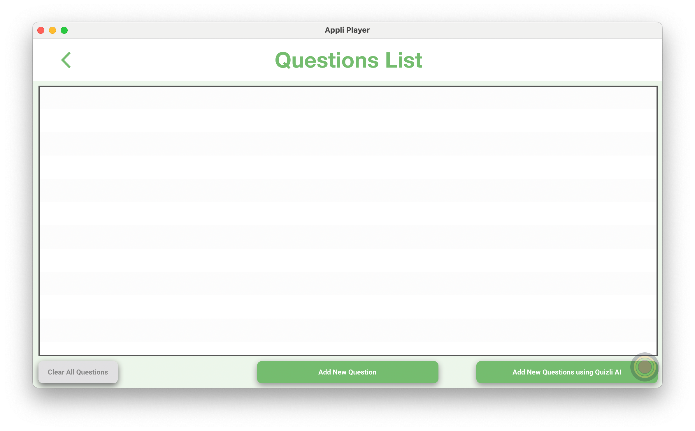

# Creating A Quiz

<figure markdown="span">

</figure>

Click the `+ Create` button on the sidebar to create a new quiz.

<figure markdown="span">

<figcaption>Create A Quizli</figcaption>
</figure>

## Selecting the play mode

Quizli supports three play modes:

- **Basic Quizli:**
- **Quiz / Test:**
- **Think Fast:**

After selecting the play mode, you can either select a _class roster_ or leave it open so that it is available to all classes.

Click `Next` to move to the next step.

## New Quiz

<figure markdown="span">

<figcaption>Enter information about your new quiz</figcaption>
</figure>

In this screen, enter the information about your quiz. This information will be used to populate the main screen of Quizli teacher app. Don't forget to add a nice image to your quiz.

!!! Note

    **Create with AI:** Clicking the _small magic wand_ will use generative AI to create a thumbnail for you.

Click on the top right `Next` button to move forward to the questions list.

## Questions List

<figure markdown="span">

<figcaption>An empty questions list</figcaption>
</figure>

The list that occupies most of the screen will display your questions.

- **Clear All Questions:** will delete all your questions. Be careful with this one.
- **Add New Question:** allows you to manually enter the information to create a new question.
- **Add New Question using Quizli AI:** let's you leverage Quizli AI to create a question based on your input.

Let's dive deeper into the two ways of creating new questions.

## Add New Question

<figure markdown="span">

<figcaption>Editing a new question</figcaption>
</figure>

That is a complex screen and to better understand it, let us go over the various sections one at a time. The top bar of the screen contains the saving and navigation controls.

<figure markdown="span">

<figcaption>Navigation and Saving</figcaption>
</figure>

On the left there is a side panel that allows you to configure the question you're editing. You can change:

- **Question Type:** there are two types of questions, multiple choice or true/false.
- **Time Limit:** configures how long the student got to answer the question.
- **Question Image:** sets an image for the question.
- **URL:** sets a web address for the question.

<figure markdown="span">

<figcaption>Configuring a question</figcaption>
</figure>

Selecting a _Question Type_ will change the interface to display the options appropriate to the selected option. Fill in your settings on the sidebar and your choices. Rememeber to use the checkbox to select what is the correct answer.

<figure markdown="span">

<figcaption>Sample Multiple Choice Question</figcaption>
</figure>

You can click `Save Question` on the top right corner to save your question, or click `+ Add Question` on the bottom left which will save your question and then go back to this screen to add a new question.
