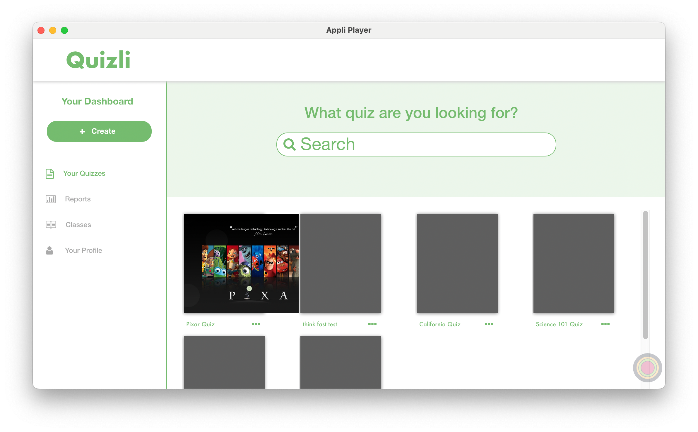

# Running A Quiz

<figure markdown="span">

</figure>

## Selecting the quiz

The Quizli teacher app opens with a list of the available quizes showing just below the search bar. Clicking a quiz will select it. If you can't find the quiz you want, you can use the _search bar_ to filter the list of quizes.

<figure markdown="span">

<figcaption>Using the search box to look for a quiz</figcaption>
</figure>
